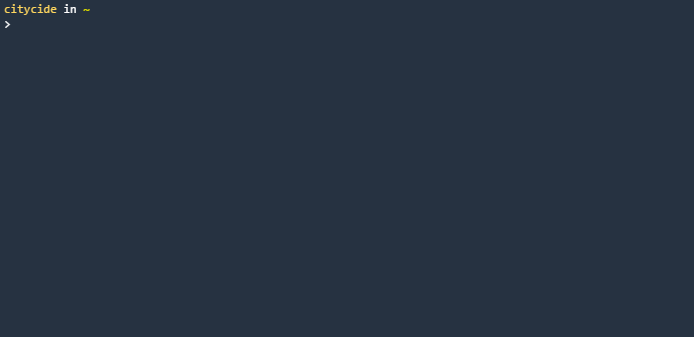

# Namesake CLI

> Find available & relevant npm package names from the command line.

- **forked version of**: https://github.com/citycide/namesake-cli

## Installation

Requires [node.js](https://nodejs.org) 14.x.x

> ```shell script
> npm i -g @melike2d/namesake-cli
> ```

---

[melike2d](https://melike2d.me)
